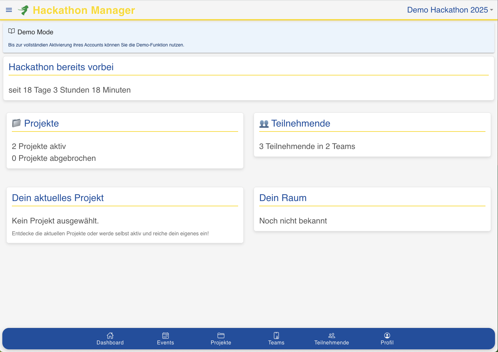
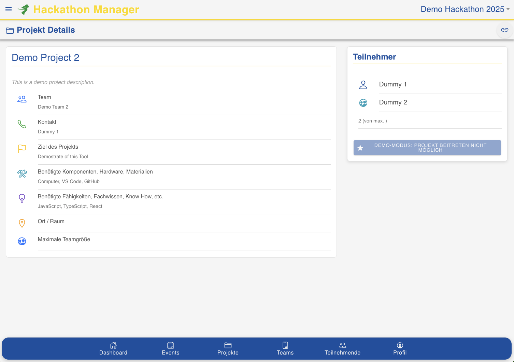
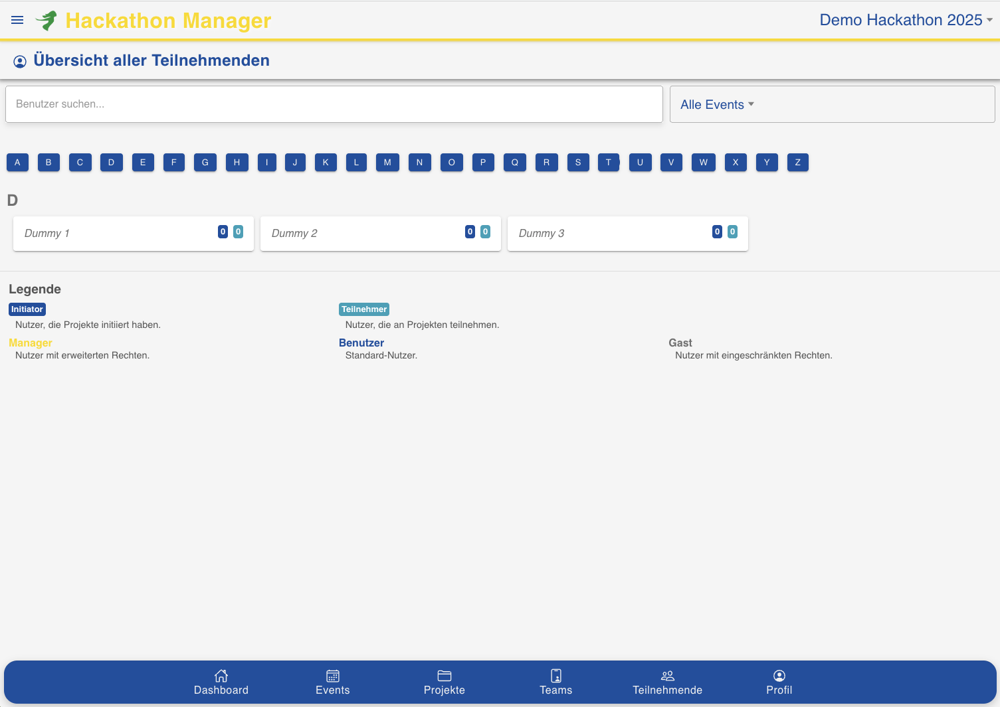

# Hackathon Manager

Der Hackathon Manager ist eine Webanwendung zur Organisation und Durchführung von Hackathons.  
Er bietet Funktionen zur Verwaltung von Projekten, Teams und Teilnehmern sowie zur Kommunikation und Zusammenarbeit während des Events.


<div style="display: flex; align-items: center;">
  
  <div>
Der Hackathon Manager ist als leidenschaftliches Hobbyprojekt des <strong>Code4Fun-Teams</strong>, in unserer Freizeit entstanden.
Als <strong>Open Source-Projekt</strong> möchten wir es mit der Community teilen und freuen uns über eure Ideen, Vorschläge und Feedback!
  </div>
</div></br>

Wer den Hackathon Managers einfach nur nutzen will, dem reicht der [Hackathon-Stack](https://github.com/jenszech/hackathon-stack).  
Mehr Informationen zur Konfiguration und zum Betrieb findest du dort.


<center></center>


## Inhalt

- [Motivation](#motivation)
  - [Funktionen](#funktionen)
- [Implementierung](#implementierung)
  - [Frontend](#frontend)
  - [Backend](#backend)
- [Howto: Wie starte ich mein Projekt](#howto-wie-starte-ich-mein-projekt)
  - [Lokal](#lokal)
  - [Per Docker](#per-docker)
- [Autoren](#autoren)
- [Lizenz](#lizenz)
- [Code of Conduct](#code-of-conduct)
- [Contribution](#contribution)
- [Build- und Test-Badges](#build-und-test-badges)

## Motivation

Hackathons sind eine großartige Möglichkeit, kreative Ideen zu entwickeln und innovative Projekte umzusetzen. Doch die Organisation eines Hackathons bringt zahlreiche Herausforderungen mit sich:

- **Effiziente Projektverwaltung**: Teilnehmer müssen ihre Projekte einreichen können, ohne dass es zu Chaos oder Missverständnissen kommt. Oft fehlt eine zentrale Plattform, um alle Projekte übersichtlich zu sammeln und zu verwalten.  
- **Transparenz bei der Projektübersicht**: Organisatoren und Teilnehmer benötigen eine klare Übersicht darüber, welche Projekte verfügbar sind und wer Teil des Teams ist.  
- **Fairness bei der Teamverteilung**: Es muss sichergestellt werden, dass sich nicht zu viele Teilnehmer für ein Projekt anmelden und jeder nur einem Projekt zugeordnet wird. Ohne klare Regeln kann dies schnell unübersichtlich werden.  
- **Teilnehmerstatistiken**: Organisatoren müssen jederzeit wissen, wie viele Teilnehmer aktiv sind, wie sie auf Projekte verteilt sind und ob die Kapazitäten ausreichend sind. Fehlende Übersicht erschwert meist die Planung und Anpassung.  
- **Nachhaltigkeit der Ergebnisse**: Nach dem Hackathon sollen die Projekte für weiterhin sichtbar bleiben. So können sie als Beispiel und Basis für künftige Hackathons dienen oder direkt als Anregung für die Produktroadmap genutzt werden.

Der Hackathon Manager wurde entwickelt, um diese Herausforderungen zu bewältigen. Er bietet eine zentrale Plattform, die sowohl Organisatoren als auch Teilnehmer unterstützt und den gesamten Prozess – von der Anmeldung bis zur Nachbereitung – vereinfacht und effizienter gestaltet.

### Funktionen
- **Eventmanagement**: Plane und verwalte Hackathon-Events mit allen relevanten Details.
- **Projektmanagement**: 
  - Erstelle und verwalte Projekte.
  - Pitchen eigener Ideen, um neue Projekte zu starten.
  - Verwalte den Status des Projekts (z. B. Pitching, läuft, abgebrochen, abgeschlossen).
- **Teamverwaltung**: 
  - Anzeige der Ansprechpartner und Ideengeber für jedes Projekt.
  - Verwaltung der Teilnehmer in Teams, einschließlich Zuordnung und Kapazitätsmanagement.
- **Eigenes Profil**: Teilnehmer können ihre Kontaktdaten und persönlichen Informationen hinterlegen.
- **Verlinkung zu MSTeams**: Integration von Microsoft Teams, um die Kommunikation innerhalb der Teams zu erleichtern.
- **Responsive Design**: Optimiert für Desktop, Tablet und mobile Geräte.

<div>
  <center>  
  </center>
</div>

## Implementierung

### Frontend
Das Frontend wurde mit **React (Ionic)** entwickelt und verwendet **Vite** als Build-Tool.  
Es befindet sich im Verzeichnis `/frontend`.

#### Wichtige Technologien:
- **React 18** mit **Ionic 8** für UI-Komponenten
- **Vite** für schnelle Builds und Hot Module Replacement
- **Axios** für API-Anfragen
- **Prettier & ESLint** für Code-Formatierung und Linting
- **Vitest & Cypress** für Tests

### Backend
Das Backend ist eine Node.js (Express) API mit einer SQLLite-Datenbank.  
Es befindet sich im Verzeichnis `/backend`.

#### Wichtige Technologien:
- **Node.js** (Express) als Web-Framework
- **SQLLite** als Datenbank
- **Swagger** für API-Dokumentation
- **JWT** für Authentifizierung
- **Dotenv** für die Verwaltung von Umgebungsvariablen
- **Docker** & **Docker Compose** für containerisierte Bereitstellungen

## Quickstart Guide
### Betreiben eines eigenen Hackathon Managers
```bash
git clone https://github.com/jenszech/hackathon-stack.git
cd hackathon-stack
docker compose up --build
```

Wenn alles klappt werden die docker container bezogen und gestartet. 
Du erreichst dann die folgenden Applikationen:

| Pfad                              | Funktion                        |
| --------------------------------- | ------------------------------- |
| http://localhost:                 | Haupt-REST-API                  |
| http://localhost:3005/api-docs/   | Backend API-Dokumentation (Swagger)     |
| http://localhost:3005/api/health/ | Backend Healthcheck             |
| http://localhost:8081             | Dozzle, abrufen der Logfiles    |

Melde dich mit den Standardanmeldedaten an:

    Benutzer: hackathon@thalia.de
    Passwort: welcome!

Eine ausführliche Dokumentation der Konfiguration und Start Optionen ist im Rahmen des  [Hackathon Stack](https://github.com/jenszech/hackathon-stack) abrufbar.

## Lokalen Source ausführen
```bash
git clone https://github.com/jenszech/hackathon-manager.git
cd hackathon-manager
```

### Lokale Laufzeitumgebung
Starten des Backends
   ```bash
   cd backend
   npm install
   npm run start-dev
   ```
Starten des Frontends
   ```bash
   cd frontend
   npm install
   npm run start-dev
   ```

Weitere Details zur lokalen Einrichtung findest du in der [Entwicklerdokumentation](docs/developing.md).

### Docker Umgebung
Starten der docker container aud dem Projekt heraus:
   ```bash
   docker compose up --build
   ```
Stoppen der Umgebung
   ```bash
   docker compose down
   ```

> **Hinweis:** Stelle sicher, dass die Ports `80`, `3005` und `8081` auf deinem System frei sind.

## Autoren

Du kannst uns fragen, wenn es irgendwelche Fragen gibt!

- [Jens Zech](https://github.com/jenszech)
- [Oliver Donzyk](https://github.com/odonzyk)

## Contribution

Wenn du zum Projekt beitragen möchtest, lies bitte die [Beitragshinweise](CONTRIBUTING.md).  
Dort findest du alle Informationen, wie du Änderungen vorschlagen und Pull Requests einreichen kannst.  

Wir freuen uns über jeden Beitrag, sei es durch das Melden von Fehlern, das Vorschlagen neuer Features oder das Einreichen von Pull Requests.  

Für eine ausführlichere Anleitung zur Einrichtung der Entwicklungsumgebung schau dir die [Entwicklerdokumentation](docs/developing.md) an!

## Build- und Test-Badges

Die Badges zeigen den aktuellen Status der Builds, die Docker-Images und die Release-Version des Projekts.

[](https://github.com/jenszech/hackathon-manager/actions/workflows/build.yaml)
[](https://github.com/jenszech/hackathon-manager/releases)
[](https://github.com/jenszech/hackathon-manager/blob/main/LICENSE.md)

[](https://github.com/users/jenszech/packages/container/package/hackathon-frontend) 
[](https://github.com/users/jenszech/packages/container/package/hackathon-backend)


