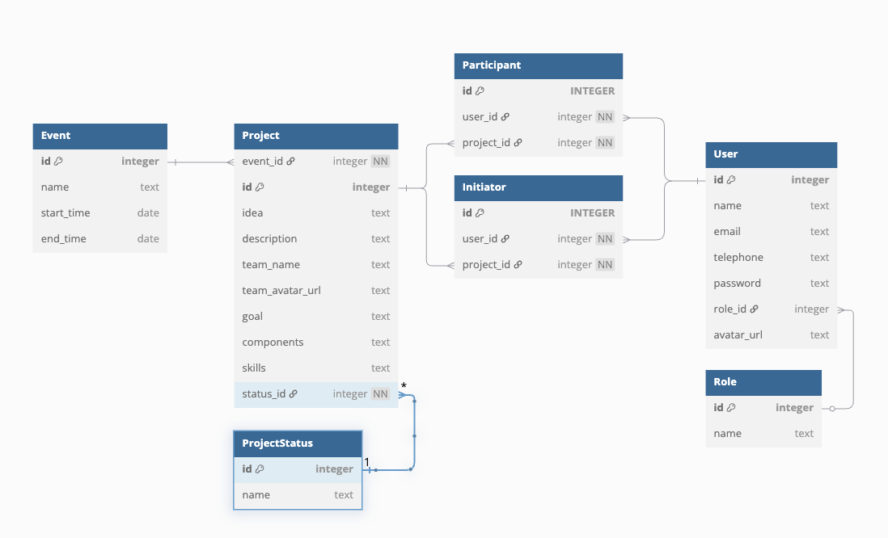

# Entwicklung

Für den Betrieb des Hackathon Managers reicht unser zweites Projekt [Hackathon-Stack](https://github.com/jenszech/hackathon-stack).  
Dort findest du detaillierte Informationen zur Konfiguration und zum Betrieb.

Wenn du selbst aktiv mitentwickeln möchtest, bist du hier genau richtig!  
Dieses Repository enthält den Quellcode für die Entwicklung des Hackathon Managers.  

Im Folgenden findest du eine umfassende Anleitung, wie du das Projekt auscheckst, einrichtest, konfigurierst und startest.

## Inhaltsverzeichnis

- [Projekt einrichten](#projekt-einrichten)
   - [Repository klonen](#repository-klonen)
   - [Einrichten der Entwicklungsumgebung](#einrichten-der-entwicklungsumgebung)
      - [Konfiguration erstellen](#konfiguration-erstellen)
         - [Verzeichnisstruktur](#verzeichnisstruktur)
         - [Backend konfigurieren](#backend-konfigurieren)
         - [Frontend konfigurieren](#frontend-konfigurieren)
      - [Abhängigkeiten installieren](#abhängigkeiten-installieren)
         - [Backend einrichten](#backend-einrichten)
         - [Frontend einrichten](#frontend-einrichten)
      - [Anwendung lokal starten](#anwendung-lokal-starten)
         - [Backend starten](#backend-starten)
         - [Frontend starten](#frontend-starten)
      - [Anwendung als Docker-Container starten](#anwendung-als-docker-container-starten)
- [Deployment-Optionen](#deployment-optionen)
  - [Lokales Deployment](#lokales-deployment)
  - [Produktives Deployment](#produktives-deployment)
- [Anwendung](#anwendung)
  - [Backend](#backend)
  - [Frontend](#frontend)
- [Architektur](#architektur)
  - [API](#api)
  - [Monitoring](#monitoring)
  - [Datenbankstruktur](#datenbankstruktur)
  - [Diagramm erstellen](#diagramm-erstellen)
- [Konventionen](#konventionen)
- [Quellen & Frameworks](#quellen--frameworks)

# Projekt einrichten
Um das Projekt lokal auszuführen, folge diesen Schritten:

1. **Repository klonen**  
   - Klone das Projekt aus dem Repository.
2. **Backend einrichten**  
   - Konfiguriere das Backend.  
   - Installiere die Abhängigkeiten.  
   - Starte das Backend.  
3. **Frontend einrichten**  
   - Konfiguriere das Frontend.  
   - Installiere die Abhängigkeiten.  
   - Starte das Frontend.  
   - Greife auf die Anwendung zu.  
4. **Zusätzliche Informationen**  
   - Führe einen Health-Check durch.  
   - Sieh dir die API-Dokumentation an.  

Beachte die [Branching-Konventionen](#git-branches) und [Commit-Konventionen](#commit-konventionen)!

## Repository klonen
Wenn du HTTP zum Klonen verwenden möchtest, musst du zuerst ein Zugriffstoken erstellen.  
Link zum Erstellen eines Zugriffstokens: [GitLab Access Token](https://gitlab-ext.drsbln.de/-/user_settings/personal_access_tokens)

Nachdem du ein persönliches "Access Token" in deinem GitLab-Benutzerprofil erstellt hast, kannst du es wie folgt verwenden:
```sh
git clone https://<Dein_Login_Name>:<dein_gitlab-token>@gitlab-ext.drsbln.de/hackathon/hackathon-manager.git
```

## Einrichten der Entwicklungsumgebung
### Konfiguration erstellen
Erstelle eine Konfigurationsdatei für die Entwicklungsumgebung. Die Konfiguration wird basierend auf der Umgebungsvariable `NODE_ENV` verwendet. Mögliche Werte für `NODE_ENV` sind:

- `dev`, `development`: Für lokale Entwicklung.
- `stage`, `staging`: Für Testumgebungen.
- `prod`, `production`: Für den produktiven Betrieb.

Falls nötig, passe die Werte in der Konfigurationsdatei an, um deine spezifischen Anforderungen zu erfüllen.

#### Verzeichnisstruktur
Die erforderliche Verzeichnisstruktur für die Entwicklungsumgebung sieht wie folgt aus:

```
.
├── backend
│   └── volumes
│       ├── config
│       │   ├── .env.example
│       │   ├── .env.dev
│       │   ├── .env.prod
│       │   └── .env.stage
│       ├── data
│       │   ├── Projects.example.js
│       │   ├── Teams.example.js
│       │   └── User.example.js
│       └── database
│           ├── hackathon.dev.db
│           ├── hackathon.prod.db
│           └── hackathon.stg.db
└── frontend
    └── volumes
        ├── config
        │   ├── .env.example
        │   ├── .env.dev
        │   ├── .env.prod
        │   └── .env.stage
        └── nginx
            └── default.conf
```

#### Backend konfigurieren
Lege die für deine Umgebung benötigten Konfigurationsdateien an. Nutze die Beispiel-Datei als Vorlage und passe sie an:

```sh
cp ./backend/volumes/config/.env.example ./backend/volumes/config/.env.dev
```

Passe die Datei `.env.dev` entsprechend deinen Bedürfnissen an.  
Eine Dokumentation der möglichen Konfigurationsparameter findest du [hier](./config_backend.md).

#### Frontend konfigurieren
Lege die für deine Umgebung benötigten Konfigurationsdateien an. Nutze die Beispiel-Datei als Vorlage und passe sie an:

```sh
cp ./frontend/volumes/config/.env.example ./frontend/volumes/config/.env.dev
```

Passe die Datei `.env.dev` entsprechend deinen Bedürfnissen an.  
Eine Dokumentation der möglichen Konfigurationsparameter findest du [hier](./config_frontend.md).

### Abhängigkeiten installieren
#### Backend einrichten
Installiere alle erforderlichen Abhängigkeiten für das Backend:
```sh
cd ./backend
npm install
```

#### Frontend einrichten
Installiere alle erforderlichen Abhängigkeiten für das Frontend:
```sh
cd ./frontend
npm install
```

### Anwendung lokal starten
#### Backend starten
Starte das Backend, nachdem die Konfiguration abgeschlossen und die Pakete installiert wurden. Beim ersten Start wird die Datenbank automatisch erstellt und initialisiert.

```sh
cd ./backend
npm run start-dev 
```

Je nach Bedarf kannst du für die verschiedenen Umgebungen die folgenden Startbefehle verwenden: `start-dev`, `start-stage`, `start-prod`.  
Der Server (Docker) verwendet allgemein `start`. Die Umgebung wird basierend auf der zuvor gesetzten Umgebungsvariable verwendet.

Überprüfe, ob das Backend läuft, indem du die folgenden Endpunkte aufrufst:

* **Health Check**: http://localhost:3005/api/health
* **API-Dokumentation (Swagger)**: http://localhost:3005/api-docs

Passe URL und Port gegebenenfalls an dein Setup an.

#### Frontend starten
Starte das Frontend:
```sh
cd ./frontend
npm run start-dev 
```

### Anwendung als Docker-Container starten
Starte das Projekt per Docker, nachdem die Konfiguration gemäß der Dokumentation erfolgt ist. Beim ersten Start wird auch hier die Datenbank automatisch erstellt und initialisiert.

- Starte die Umgebung mit:
   ```bash
   docker compose up --build
   ```
- Stoppe die Umgebung mit:
   ```bash
   docker compose down
   ```

Weitere Details findest du in der [Lokalen Deployment-Dokumentation](./local_deployment.md).

## Deployment-Optionen

### Lokales Deployment
Für die lokale Entwicklung und Tests kannst du die Anleitung in der Datei [local_deployment.md](./local_deployment.md) verwenden. Sie enthält Details zur Konfiguration und zum Starten der Umgebung.

### Produktives Deployment
Für das produktive Deployment mit Docker und Traefik findest du alle relevanten Informationen in der Datei [production_deploy.md](./production_deploy.md). Diese beschreibt die Architektur, Konfiguration und das Routing im Detail.

# Anwendung
## Backend
Das Backend stellt unter http://url:port die folgenden Endpunkte bereit. Für mehr Details siehe die entsprechende Swagger-Dokumentation unter `/api-docs/`.

| Pfad            | Funktion                       |
| --------------- | ------------------------------ |
| `/api/`         | Haupt-REST-API                 |
| `/api-docs/`    | API-Dokumentation (Swagger)    |
| `/api/health/`  | Gesundheitsprüfung             |
| `/api/metrics/` | Prometheus-kompatible Metriken |

## Frontend
Öffne die Hackathon-App in deinem Browser:

==> http://localhost:8200

Melde dich mit den Standardanmeldedaten an:

    Benutzer: hackathon@thalia.de
    Passwort: welcome!

# Architektur
## API 
Die REST-API wird automatisch mit Swagger dokumentiert. Nach dem Start ist sie verfügbar unter:
http://localhost:3005/api-docs

## Monitoring 
Für einen einfachen Health-Check kannst du http://localhost:3000/api/health aufrufen.

Für detailliertere Analysen kannst du Prometheus verwenden und die API-Messungen unter http://localhost:3005/metrics abrufen.

## Datenbankstruktur

 

### Diagramm erstellen
1. Kopiere den Code aus `db_diagram.txt`.
2. Füge ihn hier ein: [dbdiagram.io](https://dbdiagram.io/d).
3. Bearbeite und ordne die Elemente neu.
4. Erstelle ein Screenshot (Mac: Cmd + Shift + 4).
5. Ersetze `db_structure.png` mit dem neuen Bild und aktualisiere den Code.

# Konventionen
Siehe [CONTRIBUTING](../CONTRIBUTING.md).

# Quellen & Frameworks
* **API-Dokumentation (Swagger)**: [Swagger-Dokumentation](https://swagger.io/docs/)
* **Prometheus-Metriken**: [Prometheus-Dokumentation](https://prometheus.io/docs/)
